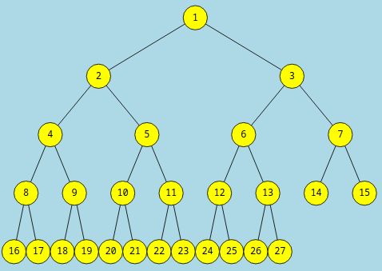

# porkostomus/graph

Simple GraphViz-style SVG binary trees/heaps



## Rationale

I have a theory. And a secret.

### Theory

I really, really love working with SVG in cljs and I think it's a potential superpower. Since it is so easy to manipulate data in Clojure, and SVG is just declarative data, I believe that it can be 100% feasible to implement many ad-hoc graphical solutions for which would be commonly thought you'd need to reach for a library like graphviz.

### Secret

I actually had so much of a pain trying to get GraphViz to work in Reagent that I gave up and decided to just do my own thing by reverse-engineering their SVG output.

I can also now attempt to mentally justify this decision by telling myself that it would have been stupid to compile a C++ program written in the 1970s into JavaScript with Emscripten, just to render a few shapes.

### Planting the naysayer

> "You have no idea how much work is involved in graph drawing. This is a foolish mission."

Believe me, I'm right with you. I'm not trying to rewrite GraphViz, but for example,

1. Start with simple binary trees. Chances are that's all I want anyway. It can also represent a heap, which I'll be able to use for my visualization of heapsort.

2. Start by only drawing edges as straight lines, seeing how far we can go with that.

The second part of The Algorithm Design Manual contains whole sections on this, one heuristic being to model the edge paths as springs and place them according to what produces the minimal "strain". 

I believe that things like this alone could cover a significant percentage of use cases, and once the appropriate primitives are abstracted, it will pave the way to covering additional ones. 

A goal I have in mind would be to move on to free trees and eventually arbitrary graphs. I'd really love to be able to create a mind-map with this to represent knowledge graphs, etc.

## Development

Do the thing:

```bash
$ npm install
added 97 packages from 106 contributors in 5.984s
```

Start the development process by running:

```bash
$ npx shadow-cljs watch app
...
[:app] Build completed. (134 files, 35 compiled, 0 warnings, 5.80s)
```

Or simply `jack-in` from your editor. Your app will be served at: at [http://localhost:8080](http://localhost:8080).

## Production build

```bash
npx shadow-cljs release app
```
